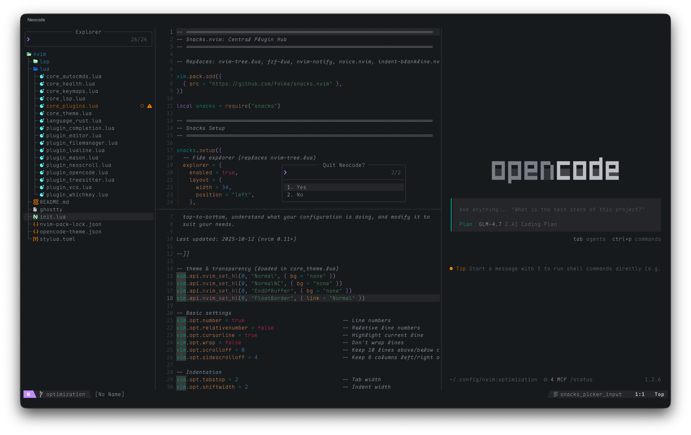

# 🎒 Neovim Configuration



This is a personal Neovim configuration for Aris Ripandi ([@riipandi][riipandi]).

This configuration is based on [Kickstart.nvim][kickstart-nvim], a starting point
for your own configuration. The goal is that you can read every line of code,
top-to-bottom, understand what your configuration is doing, and modify it to
suit your needs. If you don't know anything about Lua, I recommend taking some
time to read [through a guide][learnxinyminutes].

## Prerequisites

### Neovim 0.12+ nightly
```sh
brew uninstall neovim

curl -#L https://github.com/neovim/neovim/releases/download/nightly/nvim-macos-arm64.tar.gz | tar xz
sudo cp -R ./nvim-macos-arm64/* /usr/local/ && rm -fr nvim-macos-arm64
```

```sh
brew install ripgrep fd luarocks taplo stylua rust-analyzer serpl
brew install bash-language-server yaml-language-server python-lsp-server
brew install --cask rio

brew tap homebrew/cask-fonts
brew install --cask font-jetbrains-mono font-jetbrains-mono-nerd-font
brew install --cask font-maple-mono font-maple-mono-nf
   
brew install markdownlint-cli viu chafa
brew install jesseduffield/lazygit/lazygit
brew install jstkdng/programs/ueberzugpp
```

## IDE Setup

### Cleanup previous configuration

```sh
rm -fr ~/.config/nvim/nvim-pack-lock.json
rm -fr ~/.local/share/nvim
rm -fr ~/.local/state/nvim
rm -fr ~/.cache/nvim
```

## Dependencies (Plugins)

| Plugin                        | Description                                      |
|-------------------------------|--------------------------------------------------|
| **snacks.nvim**               | All-in-one UI utilities (picker, explorer, etc.) |
| **noice.nvim**                | Cmdline UI replacement (floating popup)          |
| **nui.nvim**                  | UI component library for noice                   |
| **blink.cmp**                 | Code completion with snippet support             |
| **friendly-snippets**         | Snippet collection                               |
| **lazydev.nvim**              | Neovim development                               |
| **colorful-menu.nvim**        | Colorful completion menus                        |
| **nvim-autopairs**            | Auto-close brackets and pairs                    |
| **todo-comments.nvim**        | Highlight TODO comments                          |
| **urlview.nvim**              | Open URLs from text files                        |
| **cloak.nvim**                | Blur lines for sensitive info                    |
| **conform.nvim**              | Slow/conforming async formatting                 |
| **miniharp.nvim**             | Quick file marks and navigation                  |
| **plenary.nvim**              | Utility functions                                |
| **lualine.nvim**              | Statusline for fancy status bar                  |
| **nvim-web-devicons**         | File type icons                                  |
| **mini.icons**                | Icon provider                                    |
| **mason.nvim**                | LSP package manager                              |
| **mason-lspconfig.nvim**      | LSP configuration for Mason                      |
| **mason-tool-installer.nvim** | Tool installer for Mason                         |
| **nvim-treesitter**           | Syntax highlighting                              |
| **lsp_signature.nvim**        | LSP signature help                               |
| **trouble.nvim**              | Pretty diagnostics UI                            |
| **fidget.nvim**               | LSP progress indicator                           |
| **nvim-lspconfig**            | LSP configuration                                |
| **gitsigns.nvim**             | Git signs in gutter                              |
| **which-key.nvim**            | Keybinding helper                                |
| **opencode.nvim**             | AI code assistant                                |
| **serpl**                     | Search & replace TUI (VSCode-like)               |

## OpenCode Theme

```sh
mkdir -p ~/.config/opencode/themes/
touch ~/.config/opencode/themes/atomizer-island.json
cat ~/.config/nvim/opencode-theme.json \
  > ~/.config/opencode/themes/atomizer-island.json
```

Documentation: https://opencode.ai/docs/themes

## Keybindings

### Command Palette

| Shortcut       | Action                                         |
|----------------|------------------------------------------------|
| `Ctrl+Shift+P` | Command palette (all commands with categories) |
| `:`            | Native cmdline (noice, with auto-complete)     |
| `Space + ;;`   | Command palette (snacks, no auto-complete)     |

**Note**:
- Native cmdline (`:`) will close when backspacing all characters (Neovim default behavior)
- Use `Space + ;;` for commands that need to stay open while editing

### Navigation

| Shortcut       | Action                                  |
|----------------|-----------------------------------------|
| `Ctrl+E`       | Switch focus between explorer ↔ editor  |
| `Ctrl+Shift+E` | Toggle file explorer                    |
| `Ctrl+B`       | Show buffer list (snacks picker)        |
|                | Use `<c-x>` or `dd` in picker to delete |
| `Ctrl+P`       | Find files (snacks picker)              |
| `Ctrl+L`       | Show marks list (miniharp)              |
| `Ctrl+N`       | Next mark                               |
| `Ctrl+Shift+M` | Previous mark                           |

### Command Palette

| Shortcut       | Action                                                                         |
|----------------|--------------------------------------------------------------------------------|
| `Ctrl+Shift+P` | Command palette (all commands with categories like File:, Buffer:, LSP:, etc.) |

### Editor

| Shortcut       | Action                              |
|----------------|-------------------------------------|
| `Ctrl+G`       | Go to line (format: `10` or `10:5`) |
| `Ctrl+Shift+G` | Toggle LazyGit                      |
| `Ctrl+Shift+S` | Toggle floating terminal            |
| `Ctrl+X`       | Close buffer                        |
| `Ctrl+Shift+W` | Close all buffers                   |
| `Space + bo`   | Close other buffers (keep current)  |
| `Ctrl+Q`       | Quit Neocode                        |
| `Ctrl+\`       | Split vertical                      |
| `Ctrl+Shift+\` | Split horizontal                    |

### Scrolling

| Shortcut       | Action                  |
|----------------|-------------------------|
| `Ctrl+Shift+J` | Scroll down (half page) |
| `Ctrl+Shift+K` | Scroll up (half page)   |
| `Alt+J`        | Move line down          |
| `Alt+K`        | Move line up            |

### Window

| Shortcut       | Action          |
|----------------|-----------------|
| `Ctrl+Alt+[`   | Previous window |
| `Ctrl+Alt+]`   | Next window     |
| `Ctrl+Alt+=`   | Increase width  |
| `Ctrl+Alt+-`   | Decrease width  |
| `Ctrl+Shift+=` | Increase height |
| `Ctrl+Shift+-` | Decrease height |

### File Explorer (snacks.explorer)

**Note**: 
- File explorer is restricted to current working directory (cwd) only. Cannot navigate to parent directories.
- Parent directory (`..`) is hidden from view.
- `h`/`Left` keys are disabled on root level to prevent navigating to parent.
- `Enter` key is disabled on `..` node.

| Shortcut | Action                        |
|----------|-------------------------------|
| `l`      | Expand folder                 |
| `Right`  | Expand folder                 |
| `h`      | Collapse folder (not on root) |
| `Left`   | Collapse folder (not on root) |
| `Enter`  | Open file (disabled on `..`)  |
| `q`      | Close explorer                |
| `a`      | Create file/folder            |
| `d`      | Delete                        |
| `r`      | Rename/move                   |
| `x`      | Cut                           |
| `p`      | Paste                         |
| `yy`     | Copy name to clipboard        |
| `yn`     | Copy filename to clipboard    |
| `yp`     | Copy absolute path            |
| `y.`     | Copy relative path            |
| `J`      | Next sibling                  |
| `K`      | Previous sibling              |
| `Ctrl+V` | Open in vertical split        |
| `Ctrl+S` | Open in horizontal split      |
| `Ctrl+T` | Open in new tab               |
| `Ctrl+E` | Open in place                 |
| `Ctrl+K` | Toggle custom filter          |
| `f`      | Live filter                   |
| `F`      | Clear filter                  |
| `[c`     | Previous git item             |
| `]c`     | Next git item                 |
| `s`      | Open with system app          |
| `u`      | Toggle hidden files           |
| `W`      | Collapse all                  |
| `E`      | Expand all                    |
| `R`      | Refresh tree                  |
| `g?`     | Show help                     |

### OpenCode (AI Assistant)

| Shortcut        | Action                               |
|-----------------|--------------------------------------|
| `Ctrl+Shift+L`  | Toggle OpenCode (right split, 65:35) |
| `leader` + `of` | Focus opencode panel (from editor)   |
| `Esc`           | Return to editor (when in opencode)  |
| `leader` + `oa` | Ask about this                       |
| `leader` + `os` | Select prompt/command                |
| `leader` + `oc` | Command                              |
| `leader` + `on` | New session                          |
| `leader` + `oi` | Interrupt session                    |
| `leader` + `ox` | Exit OpenCode (with confirmation)    |
| `leader` + `oA` | Cycle agent                          |
| `go`            | Add range to opencode (operator)     |
| `goo`           | Add line to opencode                 |
| `Ctrl+Shift+U`  | Scroll opencode up                   |
| `Ctrl+Shift+D`  | Scroll opencode down                 |

**Note**:
- Exit OpenCode (`leader+ox`) uses snacks picker dialog (same as Ctrl+Q for Quit Neocode).
- Use **cursor** for navigation and **Enter** to select Yes/No.

### Search

| Shortcut       | Action                            |
|----------------|-----------------------------------|
| `Ctrl+Shift+F` | Global search & replace (Serpl)   |
| `Space` + `sr` | Global search & replace (Serpl)   |
| `Space` + `n`  | Next search result (centered)     |
| `Space` + `N`  | Previous search result (centered) |
| `Space` + `c`  | Clear search highlights           |

**Serpl** is a VSCode-like search & replace TUI tool:
- Auto-detects git root as project root
- Search and replace across entire project
- Preview results before applying changes
- Press `q` to close serpl window

**Serpl Keymaps inside TUI:**
| Key      | Action                |
|----------|-----------------------|
| `Tab`    | Switch between tabs   |
| `r`      | Replace selected/file |
| `Ctrl+O` | Replace all files     |
| `d`      | Delete selected/file  |
| `Enter`  | Execute search        |
| `Esc`    | Exit pane/dialog      |

### Git

| Shortcut       | Action         |
|----------------|----------------|
| `Space` + `gg` | Toggle LazyGit |
| `Space` + `gs` | Git status     |
| `Space` + `gp` | Git push       |

## Clone the starter

```sh
npx tiged https://github.com/riipandi/neovim-config ~/.config/nvim
```

## Inspirations

- https://github.com/LazyVim/starter
- https://github.com/newtoallofthis123/nvim-config
- https://www.youtube.com/watch?v=55lvdPYr4j0
- https://www.youtube.com/watch?v=AAkrmfkC1L4
- https://github.com/radleylewis/nvim-lite
- https://vieitesss.github.io/posts/Neovim-new-config
- https://github.com/kezhenxu94/dotfiles/tree/main/config/nvim
- https://ricoberger.de/blog/posts/my-dotfiles/

<!-- link reference definition -->
[kickstart-nvim]: https://github.com/nvim-lua/kickstart.nvim
[learnxinyminutes]: https://learnxinyminutes.com/docs/lua
[riipandi]: https://x.com/intent/follow?screen_name=riipandi
